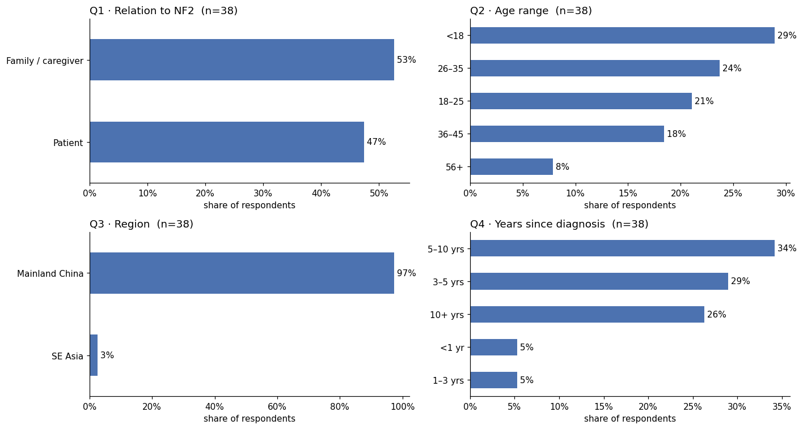
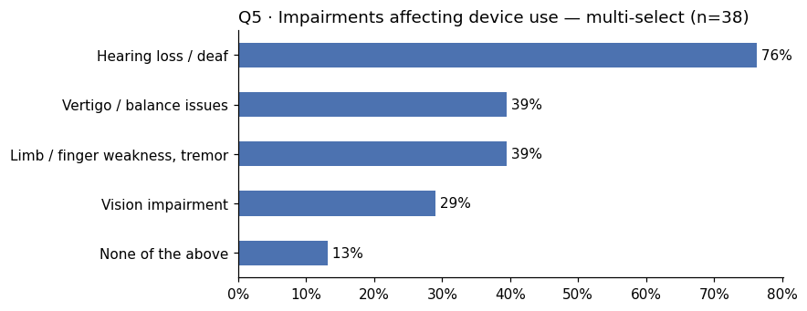

# MediPort Survey Findings — NF2 Patient & Caregiver Study

**Author:** Echo Zhao · **Date:** 2026-07-06 · **Status:** internal working report (pre-interview)
**Data:** n=38, collected 2026-06-29 → 07-05 via 泡泡家园 WeChat community (问卷星)

---

## Executive Summary

Thirty-eight NF2 patients and caregivers — from a disease community of roughly 1 in 33,000 — described how they manage a lifetime of medical records. Not one uses a structured digital tool. Two-thirds carry paper; the rest rely on memory. 71% report communication breakdowns when facing a new doctor, driven mainly by scattered records and short consults. And the most-requested feature (a plain-language research library, 50%) is one that only 8% actually behave as if they need — while the highest-stakes moment, handing a new doctor years of history in minutes, goes almost unsupported. The design target this points to: a patient-owned disease timeline with a doctor-ready one-page summary.

---

## How to read this report

This report distinguishes **evidence**, **interpretation**, and **design implication**.

- **Evidence** reports what respondents said.
- **Interpretation** proposes explanations grounded in the survey findings.
- **Design implication** identifies opportunities that will be explored further through qualitative interviews.

Where interpretations remain uncertain, they are explicitly presented as hypotheses rather than conclusions.

---

## 1. Background & method

NF2 requires lifelong, multidisciplinary monitoring, and China has no NF2 specialist centers, so patients move between hospitals and departments carrying their own history. The survey tests whether the record-fragmentation and communication problems known from lived experience generalize across the community, and which product responses patients actually prioritize.

The instrument was a bilingual 11-question survey (design rationale in `../../02_research/2_Survey_0627_PUBLISH.md`): 4 profile questions, 1 multi-select accessibility screen, 4 behavior/pain-point questions, 1 forced-choice feature prioritization (max 2 of 4), and an optional interview-recruitment field. Distribution was through the largest Chinese NF2 patient WeChat community. All percentages below are shares of n=38 unless noted; Q10 percentages are shares of the 30 respondents who answered it.

## 2. Who answered

The sample splits almost evenly between patients (47.4%) and family caregivers (52.6%) — answers therefore mix first-person and proxy perspectives, which matters when reading the accessibility data. Respondents are overwhelmingly in mainland China (97.4%). Age skews young-to-middle: 28.9% under 18 (largely caregiver-reported children), 21.1% aged 18–25, 23.7% aged 26–35.

This is an experienced population, not newly diagnosed: 89.5% are three or more years past diagnosis, and 60.5% are five or more years past. Whatever coping systems they report are mature habits, not transition-period improvisation — which makes the absence of digital tooling (below) more telling, not less.

## 3. Finding 1 — The record-keeping vacuum

**Not one of 38 respondents uses a structured digital tool** — no health app, no hospital platform — for a disease whose management is defined by longitudinal data (tumor sizes in millimeters, serial MRIs, surgical history). 65.8% rely on paper records and imaging films; the remaining 34.2% keep no system at all, relying on memory or on each doctor to reconstruct context.

The market read: this is not a crowded space with entrenched competitors. The existing tools have zero adoption in this community, which means either they are unknown, or — more likely, given the pain reported next — they don't fit how cross-hospital rare-disease care actually works in China.

## 4. Finding 2 — Communication breaks down because longitudinal information is difficult to present

### Key evidence

- **71.1%** experienced communication difficulties when consulting a new doctor.
- **36.8%** reported that their medical history was too fragmented to explain within a short consultation.
- **28.9%** felt consultation time was too limited for doctors to understand years of disease progression.
- **28.9%** reported no communication barriers.

### Interpretation

The communication challenge is not primarily a lack of medical knowledge. Instead, respondents struggle to organise years of distributed clinical information into a format that can be communicated efficiently during a consultation. This burden becomes particularly apparent when seeking second opinions or changing hospitals.

Patient communities only partially bridge this gap. Respondents identified **unverified or conflicting medical advice (34.2%)** and **information overload (31.6%)** as the two biggest limitations of existing WeChat groups, suggesting that community knowledge is difficult to verify and difficult to retrieve when needed.

### Design implication

Rather than improving communication itself, MediPort should reduce the effort required to communicate by organising longitudinal records into a concise, doctor-ready timeline and summary.

## 5. Finding 3 — The accessibility profile is the requirements list

86.8% of respondents live with at least one impairment that affects device use: hearing loss 76.3%, motor difficulty (weakness, tremor) 39.5%, balance/vestibular issues 39.5%, vision impairment 28.9%. For this population, accessibility is not a compliance checklist appended to the design — it *is* the design constraint set: visual-by-default information, large touch targets, high contrast, no motion-heavy interactions.

## 6. Finding 4 — Users value trustworthy interpretation, but need it in different contexts

### Key evidence

When asked how they would respond to a new symptom (Q7), respondents most commonly chose:

- Contact a doctor (**23.7%**)
- Ask the patient community (**23.7%**)
- Wait and observe (**21.1%**)

Only **7.9%** reported that they would consult medical literature, and another **7.9%** would review previous MRI reports.

However, when asked to prioritise future product features (Q10), the most frequently selected feature was a **plain-language research library (50.0%)**, followed by a **disease timeline (46.7%)**, **AI report parsing (43.3%)**, and a **doctor-ready summary (23.3%)**.

### Interpretation

At first glance, these findings appear contradictory. If respondents rarely consult medical literature when facing new symptoms, why is a research library the most requested feature?

A more plausible explanation is that Q7 and Q10 describe different decision contexts rather than conflicting preferences.

Q7 captures behaviour during moments of uncertainty and urgency. In these situations, respondents seek rapid reassurance from trusted sources such as physicians or experienced peers instead of independently interpreting research evidence.

Q10 reflects longer-term disease management. Outside acute episodes, respondents still want to understand emerging treatments, clinical trials, and new evidence—but they expect that information to be translated into practical, patient-friendly language.

Taken together with the reported limitations of patient communities, the findings suggest that users are not primarily asking for access to research papers; they are asking for trustworthy interpretation of medical evidence.

This interpretation will be validated during the interview phase.

### Design implication

If supported by qualitative interviews, the knowledge component should prioritise evidence interpretation rather than literature retrieval. Instead of functioning as a digital paper library, it should help patients understand whether new treatments, clinical trials, or reported breakthroughs are relevant to their own condition.

## 7. Design implications

The evidence converges on one flow: a patient-owned **disease timeline** (organizing the scattered record, the #1 pain) whose payoff action is a **doctor-ready one-page summary** (attacking the 10-minute-consult bottleneck), built visual-first for a population where 76% have hearing loss. The research library and AI parsing remain roadmap candidates, pending the interview test of the stated-vs-revealed hypothesis. This matches the locked scope in `../../01_planning/3_Case_Study_Skeleton.md`.

## 8. Limitations

Sample size (n=38) supports directional conclusions only; no significance testing is appropriate or attempted. Recruitment through one WeChat community underrepresents patients outside community networks — plausibly the most isolated ones. Roughly half of responses are caregiver proxies, which may distort self-reported accessibility needs in either direction. Q10's forced top-2 format measures salience, not value, which is exactly why Section 6 cross-reads it against behavior. Eight respondents skipped Q10 entirely.

## 9. Next steps

Five to eight in-depth interviews recruited from the 30 volunteers (79% of the sample left contact details — itself a signal of community trust and unmet need). Core probe: past *actual* behavior with translated research content, to confirm or kill the collect-it-might-need-it hypothesis before it silently shapes the product. Findings feed the persona, journey map, and design phase.