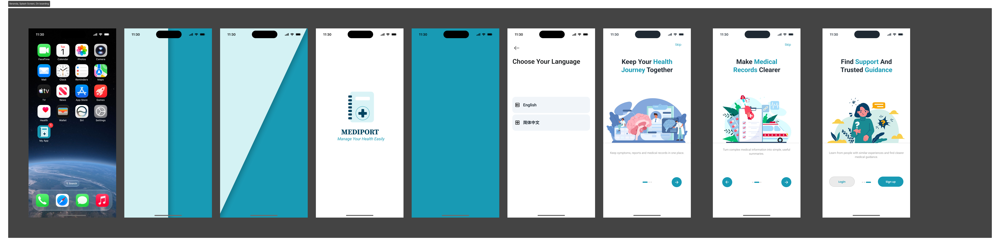
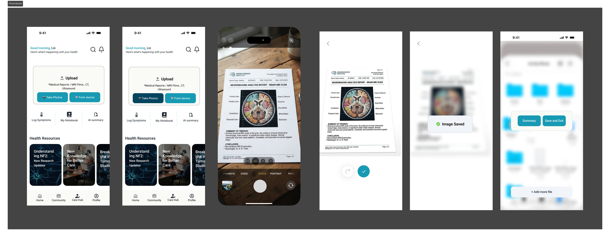

# EIHUB Challenge 2026 — Idea Proposal
# MediPort: A Patient-Owned Disease Timeline and Doctor-Ready Summary for Cross-Hospital Care

*Track: Vision to Venture (General Entrepreneurship) · Entrant: Wanting (Echo) Zhao · Monash University Malaysia*

---

## Section 1: Problem Statement

When you live with a chronic rare disease, your medical history is the single most important asset you own — and no one helps you keep it.

Neurofibromatosis Type 2 (NF2) is a rare genetic disorder that causes tumours to grow on the nerves of the brain and spine. It requires lifelong, multidisciplinary management: neurosurgery, ENT, ophthalmology, audiology, genetics, and regular MRI monitoring. In China, where my research is grounded, there is no specialised NF2 centre. Patients travel between hospitals in different cities and provinces, and each hospital's information system stops at its own front door. The patient becomes the only continuous thread in their own care — carrying plastic bags of paper reports and decaying MRI films from one consult to the next.

The consequences compound at the worst possible moment: the consultation itself. A typical outpatient consult lasts about five minutes. In that window, a patient must compress years of multi-hospital history into a coherent story, answer the doctor's questions, and absorb a decision that may mean surgery, watch-and-wait, or another hospital a thousand kilometres away. Most NF2 patients also progressively lose their hearing — so masks, clinic noise, and time pressure cut off the one communication channel they have left, exactly when the stakes are highest.

My interpretation of this problem is that it is not primarily a *record-storage* problem — cloud drives already exist. It is a **communication and information-inequality problem**. Institutions own the records; patients own the consequences. The information a doctor needs in minute one of a consult is trapped in formats (paper, film, memory) that cannot survive a five-minute, hearing-impaired, high-stakes conversation. And while NF2 is my entry point — I am an NF2 patient myself — the mechanism is shared by the much larger population of people managing any chronic condition across multiple providers, and by anyone whose disability makes spoken consultation unreliable.

The problem, stated as a design question: **how might a patient carry, own, and communicate a longitudinal medical history across institutions — in seconds, and without relying on hearing?**

## Section 2: Solution Description

MediPort is a mobile service that turns a patient's scattered records into a patient-owned disease timeline, and turns that timeline into a doctor-ready consultation summary. It is designed around one principle: **collect first, organise later** — the patient's job is only to capture; structuring is the product's job.

### How a user engages with the service, step by step

**Step 1 — Onboarding with an accessibility profile.** On first launch, the user sets their diagnosis year and an accessibility profile (e.g., hearing loss, low vision, low digital confidence). The profile adapts the whole product: text-first interactions, large type, radically simplified navigation for older caregivers.

**Step 2 — Capture anything, anytime.** After any hospital visit, the user photographs or uploads whatever they received — lab reports, discharge summaries, MRI films, even a blurry phone photo taken years ago. No forms, no manual data entry at the moment of capture. This step is deliberately effortless because our research shows the alternative (structured self-tracking) has a 100% abandonment rate in practice.

**Step 3 — The system organises.** Uploaded material is extracted, classified, and placed onto a single longitudinal timeline: which hospital, which date, which examination, which key values. (In the current concept prototype this organisation is demonstrated as the product's core promise; the AI extraction pipeline — OCR plus large-language-model document understanding — is the engineering roadmap, built on mature, commercially available technology.)

**Step 4 — Review the timeline.** The home screen is a notebook-style view of the disease journey: tumour measurements over time, surgeries, medication changes, hearing thresholds. The patient — often for the first time — can *see* their own trajectory, and compare this scan with the last one.

**Step 5 — Generate a doctor-ready summary.** Before a consult, one tap generates a concise, clinically conventional summary of the history: diagnosis, key events, latest results, current questions. Every number on the summary is tappable back to its source document, so the doctor can trust it enough to act on it. The summary is bilingual (Chinese/English) to support cross-border second opinions.

**Step 6 — The summary *is* the consultation.** In the clinic, the patient shows the summary instead of narrating from memory. The doctor reads in seconds what would take minutes to say, and their questions can be answered by tapping into the timeline — communication that no longer depends on the patient's hearing.

### Design principles and boundaries

Three constraints, harvested directly from user research, govern the design: text-first everything (spoken consults fail for 76% of our respondents); radical simplicity (a 56-year-old caregiver delivering hospital-level home care must be able to use it); and **no diagnostic advice** — MediPort organises and presents the patient's own information and never interprets it clinically, which keeps it outside medical-device regulation and inside its ethical lane.

The roadmap beyond the core flow includes a moderated patient community, remote-visit preparation, and plain-language research digests — validated as demand in our research, deferred as features.

## Section 3: Validation

### Validation completed so far

**Primary research — survey (n = 38, closed July 2026).** I designed and ran a bilingual survey of NF2 patients and caregivers through patient communities. Key findings: **100%** of respondents use no structured digital tool to manage their medical history — not one of 38 uses a health app or hospital platform; **65.8%** rely on paper documents and imaging films, and the remaining **34.2%** keep no system at all; **71.1%** report communication breakdowns when seeing new doctors or seeking cross-hospital consultations, with the leading cause (36.8%) being records too scattered to present coherently in a short consult; **76.3%** live with partial or total hearing loss.

**Primary research — interviews.** Semi-structured interviews with patients and caregivers (July 2026) surfaced the mechanisms behind the numbers: a mother maintaining ten years of her daughter's films as they physically decay; a patient who travelled across three provinces re-narrating her history at each stop; a low-tech father performing hospital-level care with no professional guidance nearby. These became the three personas that anchor the design.

**Clinical review.** A physician collaborator (paediatrics-trained, preparing an NF2-focused PhD) reviews the medical accuracy of the concept — terminology, care-journey realism, and the boundary between information management and medical advice.

**External institutional validation.** The MediPort concept was selected into the 6th cohort of PwC China's disability-inclusion programme ("Inclusive Future Lab"), where it is currently being developed as a six-week structured project (20 July – 30 August 2026) with mid-term and final reviews. An external professional-services firm choosing to sponsor this concept is independent evidence of its perceived social and practical value.

**Secondary research.** NF2 affects roughly 1 in 25,000–33,000 births (commonly cited incidence figures), and China's rare-disease population is widely estimated at around 20 million people. More broadly, the mechanism MediPort addresses — fragmented records across providers — is documented internationally; companies such as PicnicHealth in the US have built venture-backed businesses purely on assembling patient-owned longitudinal records, validating both the pain and the willingness to pay.

### Validation planned if selected for the Final Round

Usability testing is already scheduled (five moderated sessions in August 2026, recruited from the survey's volunteer pool, mixing NF2 patients with proxy users such as chronic-disease record-keepers and hearing-loss users). If accepted into the Final Round, I would additionally run: a task-based test of the summary artefact with practising clinicians (does a doctor trust and use it inside five minutes?); a pilot with a Chinese rare-disease patient organisation to test capture behaviour over several weeks; and a willingness-to-pay survey across the broader chronic-disease segment to firm up the pricing assumptions in Section 4.

## Section 4: Business Model

MediPort would operate as a freemium consumer subscription with institutional partnerships — comparable to how PicnicHealth (records-as-a-service) and Flo (freemium health subscription) operate, adapted to the Chinese healthcare context.

### a. Desirability — who wants this, and will they pay?

**Beachhead market:** Chinese NF2 and rare-disease patients and their family caregivers. This segment is small but has the most acute version of the problem — lifelong monitoring, mandatory multi-hospital journeys, no specialised centres — and is organised into reachable patient communities, which makes early distribution cheap and credible.

**Expansion market:** the far larger population managing chronic conditions (cancer follow-up, diabetes, cardiovascular disease, elderly patients with multiple conditions) across multiple providers, plus users whose disabilities make spoken consultation unreliable. The product mechanics are identical; only the content templates change.

**Evidence of demand.** The survey evidence is unambiguous: everyone has the problem (100% without tools, 71.1% experiencing communication breakdowns) and no one has a solution. The costs users already bear are substantial: repeated examinations because prior results were lost or unpresentable (an MRI costs several hundred to over a thousand RMB), cross-province travel for consultations that fail for communication reasons, and unpaid caregiver hours spent maintaining paper archives. Against those costs, a subscription priced in the range of a single coffee per month (15–25 RMB) is easily rationalised — one avoided repeat scan pays for years of service.

**Competitive landscape.** Hospital apps and regional health platforms are institution-bound: records stop at the hospital's boundary, which is precisely the problem. Generic cloud drives store files but create no structure, no timeline, no summary. Existing consumer "records folder" apps in China have low adoption in this segment — our survey found zero usage — because they demand manual data entry and ignore accessibility. No competitor treats the *consultation itself* as the moment to design for. MediPort's differentiation is the combination: patient-owned, longitudinal, accessibility-first, and consult-ready.

### b. Feasibility — can it be delivered?

Every component of MediPort rests on mature, commercially available technology: smartphone cameras, cloud storage, OCR, and large-language-model document extraction — the last of which has, in the past three years, turned "read a messy scanned medical report into structured data" from a research problem into an API call. No new science is required; the innovation is in the workflow and the design.

The founding capability matches the build: I bring data-science training (Master of Data Science, Monash) and end-to-end UX skills; clinical review is secured through the physician collaborator. A functional MVP — capture, extraction for the most common report types, timeline, summary generation — is within reach of a small team (2–3 engineers plus design) in roughly six months, with cloud and model-inference costs per active user in the low single-digit RMB per month, comfortably below the proposed subscription price.

Two feasibility risks are acknowledged and designed for. **Regulatory:** MediPort stores and presents the patient's own information and gives no diagnosis or treatment advice, keeping it outside medical-device classification; personal health data handling would comply with China's Personal Information Protection Law, with health-data storage localised and consent-based. **Extraction accuracy:** every extracted value remains tappable back to its source image, so an extraction error is inspectable and correctable rather than silently trusted — a design decision that doubles as the trust mechanism for doctors.

### c. Viability — can it sustain itself?

**Revenue streams, in sequence.** (1) *Freemium subscription:* free capture and storage; paid tier (15–25 RMB/month) for unlimited AI organisation, summary generation, and family sharing. Caregivers — who manage records for children and elderly parents — are the most willing payers. (2) *B2B2C partnerships:* patient organisations, commercial health insurers (who benefit directly when repeat examinations are avoided), and pharmaceutical companies running rare-disease programmes can sponsor subscriptions for their communities. (3) *Longer term, consent-based real-world data:* structured longitudinal histories of rare-disease patients are scarce and scientifically valuable; strictly opt-in, aggregated, and ethics-reviewed collaboration with researchers could become a revenue stream that also serves patients' own interest in accelerating research.

**Cost structure.** Dominated by engineering salaries pre-launch and model-inference plus storage costs at scale — both of which are falling yearly. There is no physical inventory, no per-city rollout cost, and distribution through patient communities is near-zero-cost; the model scales the way software scales.

**Why this can win.** The wedge is a market too small and too difficult (accessibility requirements, trust requirements) for large platforms to prioritise, but where lived-experience credibility creates immediate distribution. Once patients own structured longitudinal records, MediPort becomes the default interface between them and every future provider — a position that makes institution-bound alternatives progressively less relevant, rather than the other way around. Funding paths for the stage between prototype and MVP already exist and are warm: disability-inclusion CSR programmes (PwC being a live example), university incubation, and impact-focused grants.

## Section 5: Personal Introduction

My name is Wanting Zhao — I go by Echo. I am a Master of Data Science student at Monash University Malaysia, a UX designer trained through the Google UX Design certificate, and an NF2 patient who lost her hearing as an adult.

I did not arrive at this problem; I live in it. I have sat in the five-minute consult trying to reconstruct years of history from a bag of films while lip-reading a masked doctor. For a long time I assumed this was simply what being a rare-disease patient meant. The turning point came when I surveyed my own community and watched the numbers come back: not one of 38 respondents had any tool for this. What I had experienced as a personal failing was a designed absence — a gap every institution had rationally declined to fill, because the people who suffer from it are, individually, too few to matter.

That reframing — from "my problem" to "an unserved market with a structural cause" — is the journey behind this proposal. I began with empathy research because my UX training demanded it, and the research repaid me by correcting my assumptions: I believed the core need was storage; interviews showed it was the consult. I believed patients wanted to organise; the data showed they will only capture, so the product must organise. Each step from problem statement to solution was forced by evidence rather than by my own preferences, and I have tried to keep it that way.

I lead this work as the sole entrant to this challenge, and I want to credit the two remote collaborators who support the wider project — an accessibility researcher and a physician preparing an NF2-focused PhD — for review and clinical grounding. My lived experience is not the headline of this idea; it is the method: it tells me where the pain actually is, gives me trusted access to a hard-to-reach user community, and holds the design honest. MediPort is the product I needed on the worst days of my own care journey — and the evidence says I was never the only one.

---

## References

1. Project survey: NF2 Patient-Led Care Survey, bilingual, n = 38, closed 5 July 2026 (instrument and analysis available on request).
2. Semi-structured patient and caregiver interviews, July 2026 (anonymised transcripts available on request).
3. Evans, D. G. R. — epidemiological literature on Neurofibromatosis Type 2 incidence (approx. 1 in 25,000–33,000 births).
4. PicnicHealth (picnichealth.com) — comparator: patient-owned longitudinal medical records as a venture-backed business.
5. Personal Information Protection Law of the People's Republic of China (2021) — compliance basis for health-data handling.
